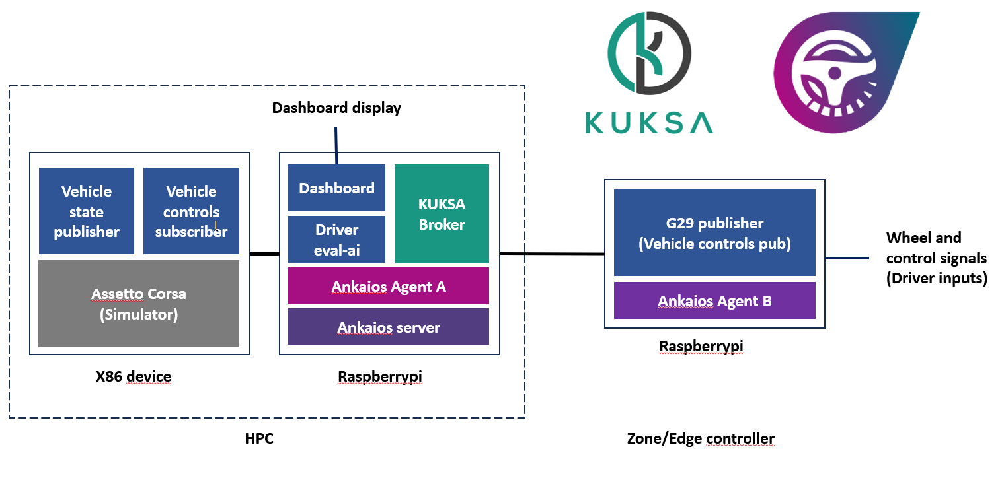
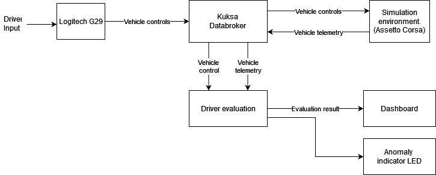

# DriveSim-by-wire

## Introduction

DriveSim-by-wire is a platform designed to seamlessly collect and process control signals from the vehicle's input peripherals, such as the steering wheel and pedals. These control signals can then be used to control a simulation environment (e.g. Asetto Corsa) to evaluate and improve the driver's behaviour and driving techniques. The platform can also provide entertainment for the driver by taking advantage of the vehicle controls to interact with a driving game (or any other game) while the car is parked (e.g. plugged in to charger)

## System architecture

The system consists of multiple containarized workloads that are orchestrated and managed by Ankaios framework. The data layer is built on the Vehicle Signal Specification (VSS) and is using Eclipse Kuksa Databroker implementation of VSS for seamless integration of the different workloads

The data layer is based on the Vehicle Signal Specification (VSS) by using Eclipse Kuksa Databroker. Such approach enables standarized access to the vehicle control data, ensuring seamless integration with our simulation and environment and driver evaluation workload.

### Data model

### Key components

#### Eclipse Kuksa Databroker

Central data exhange service responsible of ensuring the transfer of data between other workloads. Checkout [the official repository](https://github.com/eclipse-kuksa/kuksa-databroker) for more information on Kuksa databroker.

#### Logitech G29 publisher

Integrates the Logitech G29 steering wheel and pedals to emulate an actual steering wheel. It reads the raw data input from the steering wheel and publishes the following topics to the Eclipse Databroker:

1. Vehicle.Chassis.Axle.Row1.SteeringAngle
2. Vehicle.Chassis.Accelerator.PedalPosition
3. Vehicle.Chassis.Brake.PedalPosition
4. Vehicle.Powertrain.Transmission.CurrentGear

For more information on how to setup and run the publishe checkout the [README](G29-publisher/README.md).

#### Simulation environment

The platform emulates a controller connected to our x86 device that run the simulation. Meaning that we can run any simulation environment or game that cat be controlled using Xbox360 controller. Currently we've tested the setup with [Asetto Corsa](https://assettocorsa.gg/), which a realistic driving simulator that can also provide telemtery on the car behaviour and physics.

#### Dashboard

A visual monitoring interface displaying information on the vehicle state, control inputs, and driver performance and anamolies. It works by subscribing to VSS topics through the Kuksa databroker. The current implementation displays information such as the speed, throttle input, and brake input of the simulated vehicle. It also relies on custom defined VSS topics to show information on driver evaluation, such as the number of anomalies detected from the driver's behaviour.

#### Vehicle controller

Implements a drive-by-wire system. It interprents user inputs by reading the respective VSS topics and applies these controls to our simulation environment

#### Data evaluation

Runs the driver evaluation and anomaly detection model. The model was trained on the same setup and can detect anomalies such as panic braking. More information can be found in the [README](Drive-data-eval)

### Ankaios

The configuration files and scripts required to deploy our platform. In-depth description on how the setup works can be found in the [README](ankaios)

## Future Work

The system can be extended later to add more evaluation metrics to the driver evaluation component such as monitoring the drivers throttle application to improve fuel efficiency or monitoring the driver's upshifts and downshifts to improve engine and gearbox lifetime.
